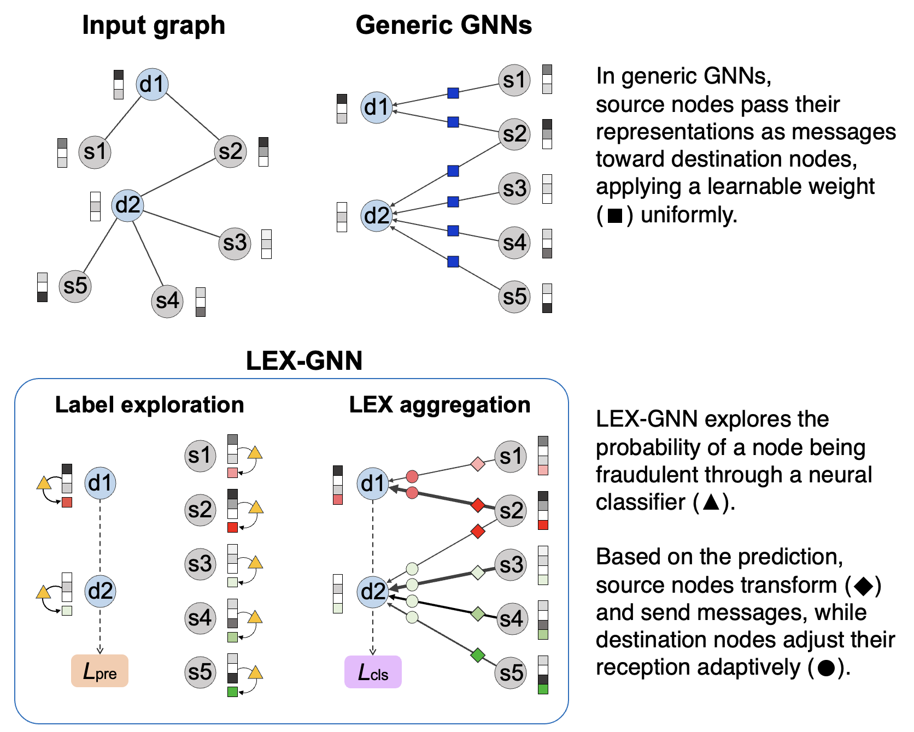

# LEX-GNN

The author implementation for the [CIKM 2024](https://dl.acm.org/doi/10.1145/3627673.3679956) short paper  
**LEX-GNN: Label-Exploring Graph Neural Network for Accurate Fraud Detection**.

Woochang Hyun, Insoo Lee, [Bongwon Suh](https://scholar.google.co.kr/citations?user=-nlhtEkAAAAJ&hl=en)

## Overview

     
    
     

