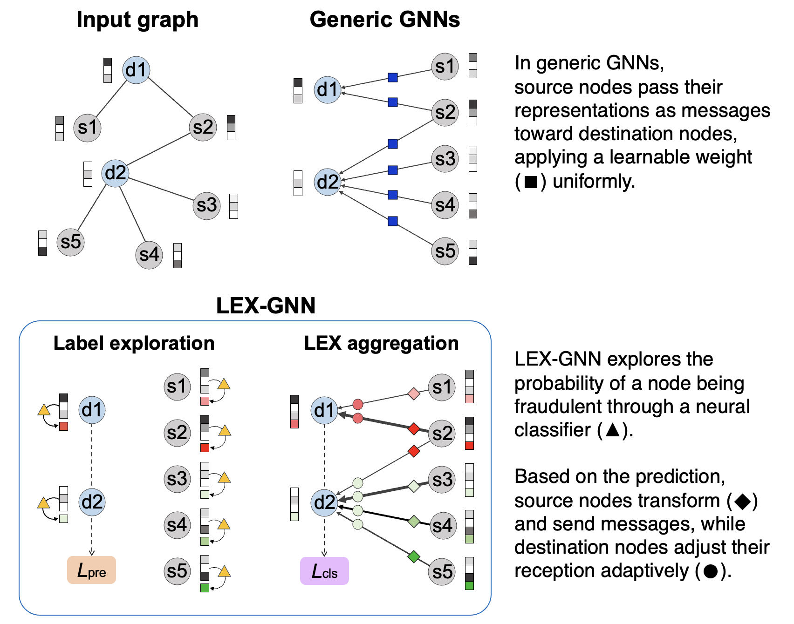

# LEX-GNN

The author implementation for the [CIKM 2024](https://dl.acm.org/doi/10.1145/3627673.3679956) short paper  
**LEX-GNN: Label-Exploring Graph Neural Network for Accurate Fraud Detection**.

[[Paper](https://dl.acm.org/doi/10.1145/3627673.3679956)] [[Poster](./lex_poster.pdf)]

Woochang Hyun, 
Insoo Lee, 
[Bongwon Suh](https://scholar.google.co.kr/citations?user=-nlhtEkAAAAJ&hl=en)

## Overview

    

**L**abel-**Ex**ploring **G**raph **N**eural **N**etwork (**LEX-GNN**) is a GNN-based fraud detector that predicts the fraud likelihood of nodes in a semi-supervised manner and adaptively adjusts the message passing pipeline for enhanced detection.
